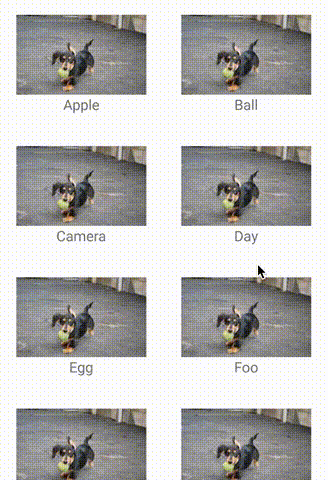

RecyclerView Animators
======================
<p align="center">
  
</p>

[](https://android-arsenal.com/details/1/1327)
[](https://www.apache.org/licenses/LICENSE-2.0)
[](https://search.maven.org/artifact/jp.wasabeef/recyclerview-animators)

RecyclerView Animators is an Android library that allows developers to easily create RecyclerView with animations.

Please feel free to use this.

# Features

* Animate addition and removal of [`ItemAnimator`](#itemanimator-1)
* Appearance animations for items in [`RecyclerView.Adapter`](#recyclerviewadapter)

# Demo

### ItemAnimator
  

### Adapters
 

# How do I use it?

## Setup

#### Gradle

On your module's `build.gradle` file add this implementation statement to the `dependencies` section:

```groovy
dependencies {
  // Kotlin
  implementation 'jp.wasabeef:recyclerview-animators:4.0.2'
}
```

Also make sure that the `repositories` section includes not only `"mavenCentral()"` but also a `maven` section with the `"google()"` endpoint. 

```
repositories {
  google()
  mavenCentral()
  jcenter()
}
```

## ItemAnimator
### Step 1

Set RecyclerView ItemAnimator.

```kotlin
val recyclerView = findViewById<RecyclerView>(R.id.list)
recyclerView.itemAnimator = SlideInLeftAnimator()
```

```kotlin
val recyclerView = findViewById<RecyclerView>(R.id.list)
recyclerView.itemAnimator = SlideInUpAnimator(OvershootInterpolator(1f))
```

## Step 2
Please use the following  
`notifyItemChanged(int)`  
`notifyItemInserted(int)`  
`notifyItemRemoved(int)`  
`notifyItemRangeChanged(int, int)`  
`notifyItemRangeInserted(int, int)`  
`notifyItemRangeRemoved(int, int)`  

> If you want your animations to work, do not rely on calling `notifyDataSetChanged()`; 
> as it is the RecyclerView's default behavior, animations are not triggered to start inside this method.

```kotlin
fun remove(position: Int) {
  dataSet.removeAt(position)
  notifyItemRemoved(position)
}

fun add(text: String, position: Int) {
  dataSet.add(position, text)
  notifyItemInserted(position)
}
```

### Advanced Step 3

You can change the durations.

```kotlin
recyclerView.itemAnimator?.apply {
  addDuration = 1000
  removeDuration = 100
  moveDuration = 1000
  changeDuration = 100
}
```

### Advanced Step 4

Change the interpolator.

```kotlin
recyclerView.itemAnimator = SlideInLeftAnimator().apply {
  setInterpolator(OvershootInterpolator())
}
```

### Advanced Step 5

By implementing AnimateViewHolder, you can override preset animation.
So, custom animation can be set depending on view holder.

```kotlin
class MyViewHolder(itemView: View) : RecyclerView.ViewHolder(itemView), AnimateViewHolder {

  override fun preAnimateRemoveImpl(holder: RecyclerView.ViewHolder) {
    // do something
  }

  override fun animateRemoveImpl(holder: RecyclerView.ViewHolder, listener: ViewPropertyAnimatorListener) {
    itemView.animate().apply {
      translationY(-itemView.height * 0.3f)
      alpha(0f)
      duration = 300
      setListener(listener)
    }.start()
  }

  override fun preAnimateAddImpl(holder: RecyclerView.ViewHolder) {
    itemView.setTranslationY(-itemView.height * 0.3f)
    itemView.setAlpha(0f)
  }

  override fun animateAddImpl(holder: RecyclerView.ViewHolder, listener: ViewPropertyAnimatorListener) {
    itemView.animate().apply {
      translationY(0f)
      alpha(1f)
      duration = 300
      setListener(listener)
    }.start()
  }
}
```

### Animators

#### Cool
`LandingAnimator`

##### Scale
`ScaleInAnimator`, `ScaleInTopAnimator`, `ScaleInBottomAnimator`  
`ScaleInLeftAnimator`, `ScaleInRightAnimator`


##### Fade
`FadeInAnimator`, `FadeInDownAnimator`, `FadeInUpAnimator`  
`FadeInLeftAnimator`, `FadeInRightAnimator`

##### Flip
`FlipInTopXAnimator`, `FlipInBottomXAnimator`  
`FlipInLeftYAnimator`, `FlipInRightYAnimator`

##### Slide
`SlideInLeftAnimator`, `SlideInRightAnimator`, `OvershootInLeftAnimator`, `OvershootInRightAnimator`  
`SlideInUpAnimator`, `SlideInDownAnimator`

## RecyclerView.Adapter
### Step 1

Set RecyclerView ItemAnimator.

```kotlin
val recyclerView = findViewById<RecyclerView>(R.id.list)
recyclerView.adapter = AlphaInAnimationAdapter(MyAdapter())
```

#### Java
```java
RecyclerView recyclerView = findViewById(R.id.list);
recyclerView.setAdapter(new AlphaInAnimationAdapter(MyAdapter());
```

### Advanced Step 2

```kotlin
recyclerView.adapter = AlphaInAnimationAdapter(MyAdapter()).apply {
  // Change the durations.
  setDuration(1000)
  // Change the interpolator.
  setInterpolator(vershootInterpolator())
  // Disable the first scroll mode.
  setFirstOnly(false)
}
```

#### Java
```java
AlphaInAnimationAdapter alphaInAnimationAdapter = new AlphaInAnimationAdapter(new MyAdapter());
alphaInAnimationAdapter.setDuration(1000);
alphaInAnimationAdapter.setInterpolator(new OvershootInterpolator());
alphaInAnimationAdapter.setFirstOnly(false);
```

### Advanced Step 3

Multiple Animations

```kotlin
val alphaAdapter = AlphaInAnimationAdapter(MyAdapter())
recyclerView.adapter = ScaleInAnimationAdapter(alphaAdapter)
```

#### Java
```java
recyclerView.setAdapter(new ScaleInAnimationAdapter(alphaInAnimationAdapter));
```

### Adapters

#### Alpha
`AlphaInAnimationAdapter`

#### Scale
`ScaleInAnimationAdapter`

#### Slide
`SlideInBottomAnimationAdapter`  
`SlideInRightAnimationAdapter`, `SlideInLeftAnimationAdapter`

Applications using RecyclerView Animators
---

Please [ping](mailto:dadadada.chop@gmail.com) me or send a pull request if you would like to be added here.

Icon | Application
------------ | -------------
 | [Ameba Ownd](https://play.google.com/store/apps/details?id=jp.co.cyberagent.madrid)
 | [QuitNow!](https://play.google.com/store/apps/details?id=com.EAGINsoftware.dejaloYa)
 | [AbemaTV](https://play.google.com/store/apps/details?id=tv.abema)
 | [CL](https://play.google.com/store/apps/details?id=com.cllive)

Developed By
-------
Daichi Furiya (Wasabeef) - <dadadada.chop@gmail.com>

<a href="https://twitter.com/wasabeef_jp">

</a>

Contributions
-------

Any contributions are welcome!

Contributers
-------

* [craya1982](https://github.com/craya1982)

Thanks
-------

* Inspired by `AndroidViewAnimations` in [daimajia](https://github.com/daimajia).

License
-------

    Copyright 2020 Daichi Furiya / Wasabeef

    Licensed under the Apache License, Version 2.0 (the "License");
    you may not use this file except in compliance with the License.
    You may obtain a copy of the License at

       http://www.apache.org/licenses/LICENSE-2.0

    Unless required by applicable law or agreed to in writing, software
    distributed under the License is distributed on an "AS IS" BASIS,
    WITHOUT WARRANTIES OR CONDITIONS OF ANY KIND, either express or implied.
    See the License for the specific language governing permissions and
    limitations under the License.
